# Customer_Subscription_Decision

### Introduction
With the rapid development of the telecommunication industry, the service providers are inclined more towards expansion of the subscriber base. To meet the need to survive in the competitive environment, the retention of existing customers has become a huge challenge. It is stated that the cost of acquiring a new customer is far more than that of retaining the existing one. Therefore, the telecom industries must use advanced analytics to understand consumer behavior and in turn, predict the association of the customers as to whether they will leave the company.

### About the dataset
Link to dataset: [Link to the dataset on Kaggle HERE](https://www.kaggle.com/datasets/barun2104/telecom-churn?resource=download)

### Project Objective
The objective of this project is to predict whether customers will churn telecom services or not. To do this, we employ the Decision Tree algorithm. Here, our target variable is “Churn” which has two inputs.
1: Customer will cancel the service, 0: Customers will not cancel the service.

### Project Insight
* What variables are contributing to customer churn?
* Who are the customers more likely to churn?
* What actions can be taken to stop them from leaving?

### Program:
Python (Google Collab)
R

## PYTHON MACHINE LEARNING ALGORITHM: DECISION TREE
•	Importing necessary libraries and datasets.  
•	View some parts of the dataset.

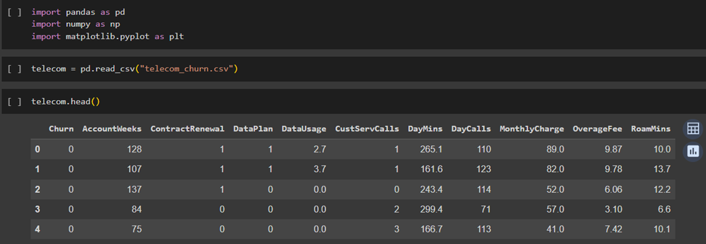

Displaying the list of features available in the dataset

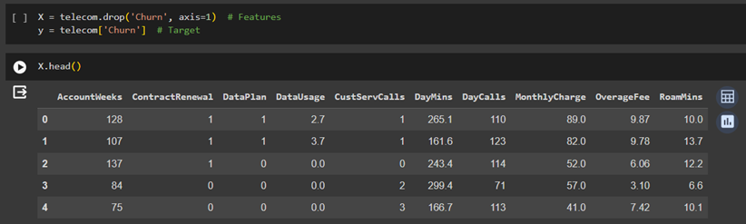

Checking the data types in the dataset

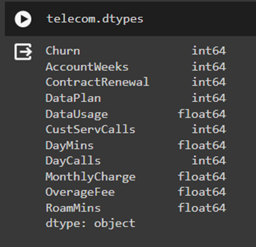

The shape of the dataset (3,333 records, and 11 features)

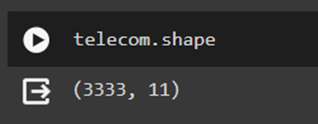

Checking the first few and last rows in the dataset

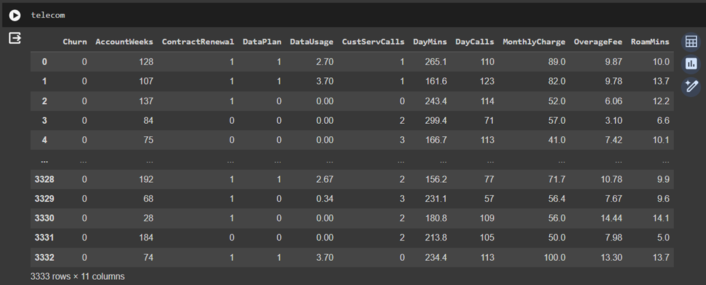

Defining the Target and other variables in the dataset

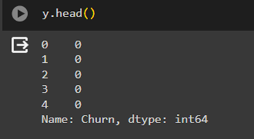

X = telecom.drop('Churn', axis=1): This line of code selects all the columns in the telecom data frame except for the column named 'Churn'.  
The drop method removes the 'Churn' column from the Data Frame and returns a new Data Frame (X) with the remaining columns. This new data frame contains the features or independent variables that will be used as input for the model.

y = telecom['Churn']: This line of code selects the 'Churn' column from the telecom Data Frame and assigns it to the variable y.  
The 'Churn' column is assumed to be the target variable or the dependent variable that we want to predict in the machine learning model. This target variable typically represents whether a customer has churned (left the service) or remained (retained the service). The X.head() displays few records in the data frame after the removal of the target label and y.head() shows few records from the target variable named **“Churn”**

Plotting Scatterplot to visualize the relationship among the features

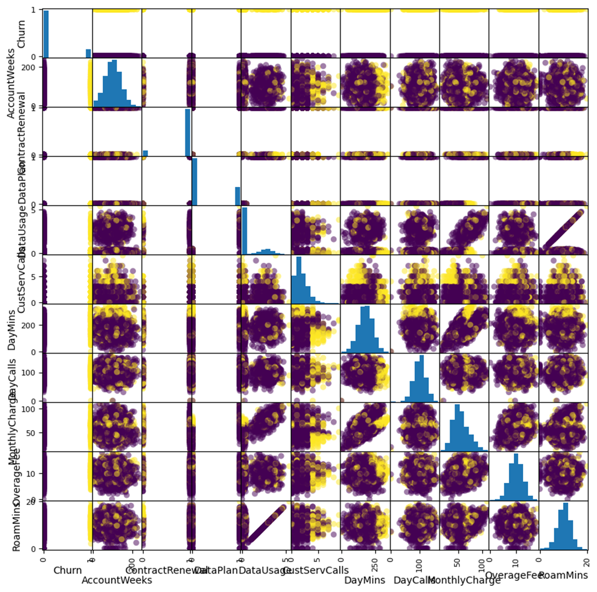

The scatter matrix plot provides valuable insights into the relationships between variables in the data by creating a grid of pairwise scatter plots. This grid illustrates how different features interact with each other, shedding light on potential correlations and patterns. Plus, the plot’s-colored points indicate whether a customer has churned or remained loyal, giving a clear visual representation of how customer behavior aligns with various features.

* Import the Train_Test_Split library from Sci-light Package
* Splitting the data into two sets (Train and Test set)
* Split ration: Train set = 65% and Test set = 25%
* Randon number reproducible state for this result = 45
* Check the dataframe size of the splitting (Train and Test set)

  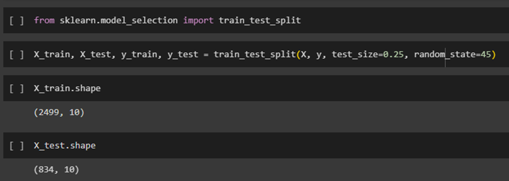

  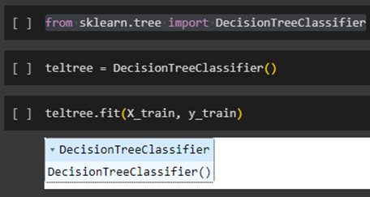
  
* The statement from sklearn.tree import DecisionTreeClassifier imports the DecisionTreeClassifier class from the sklearn.tree module.  
* This class is a part of the scikit-learn library, a popular machine-learning library in Python. 
* The code snippet teltree = DecisionTreeClassifier() creates an instance of the DecisionTreeClassifier class and assigns it to the variable teltree. teltree.fit(X_train, y_train): The provided line of code demonstrates how to train a 
  decision tree classifier using a training set.

  Checking the Accuracy of the model
  
  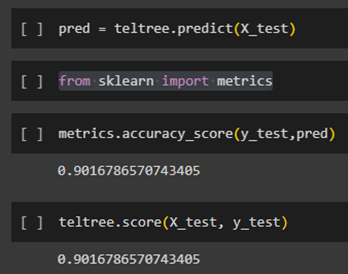
  
•	pred = teltree.predict(X_test) uses the trained decision tree classifier (teltree) to make predictions on the test set (X_test).
•	The import statement from sklearn import metrics imports the metrics module from the scikit-learn library.
•	The output of the metrics.accuracy_score(y_test, pred) function is 0.9017 (rounded to four decimal places). This means that the decision tree classifier (teltree) achieved an accuracy of approximately **90.17%** on the test set.  
Accuracy is a common metric used to evaluate the performance of classification models. It measures the proportion of correct predictions (both true positives and true negatives) out of the total number of predictions.  
In other words, it tells us how often the model correctly predicted the target variable.

  Importing the Confusion Matrix metrics from the Sklearn package.
  
  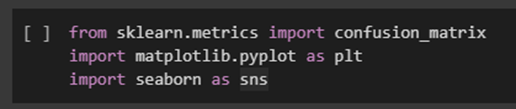

