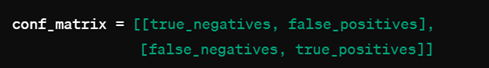
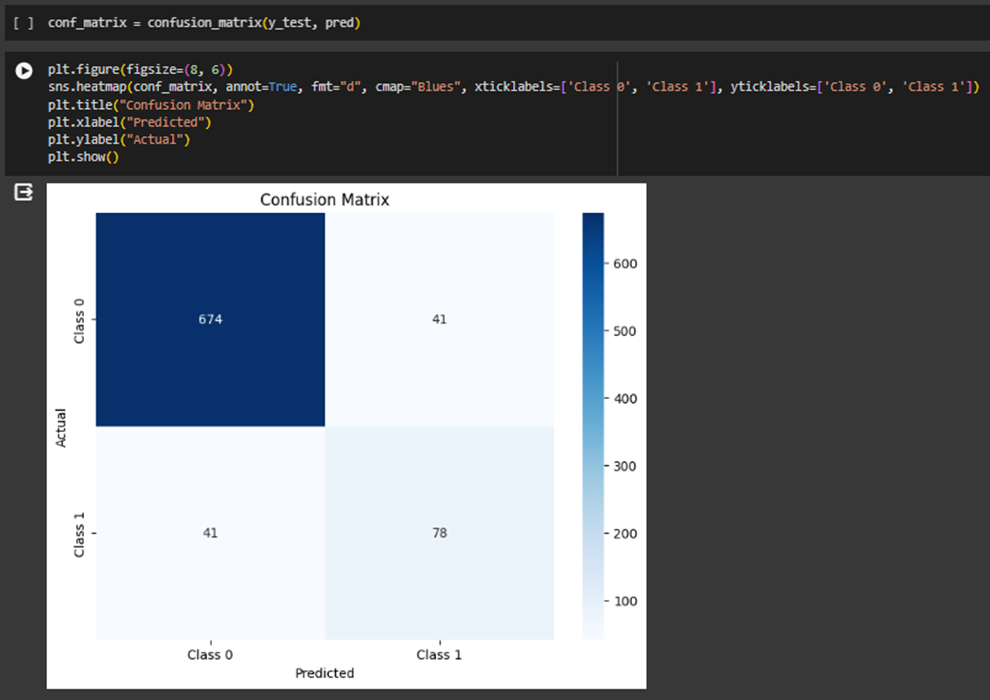
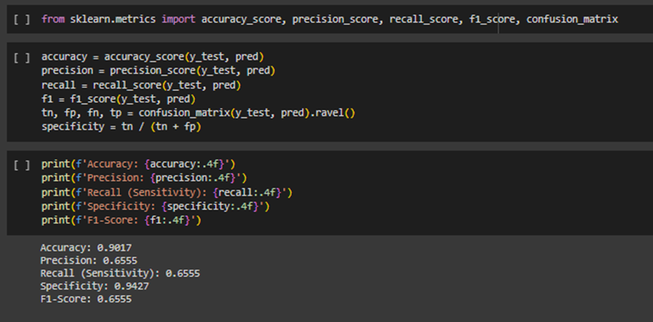
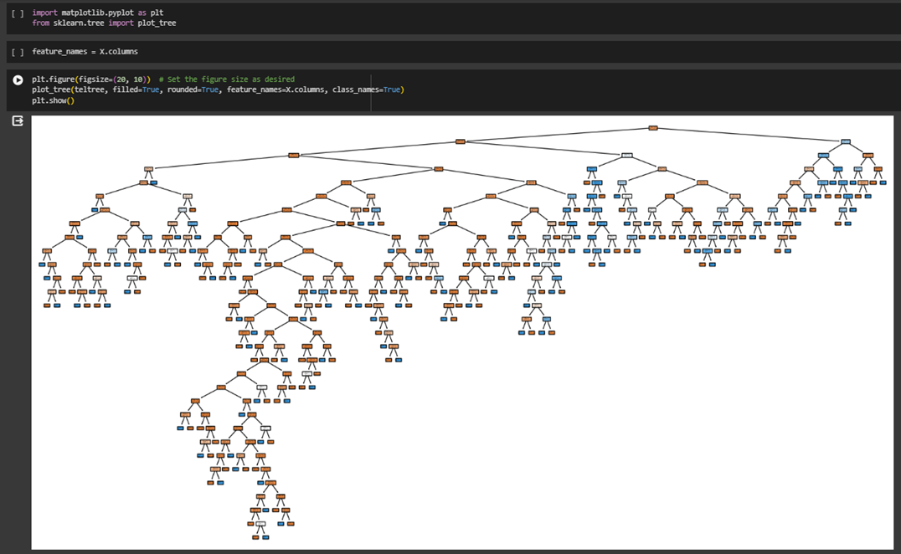

# Customer_Subscription_Decision

### Introduction
With the rapid development of the telecommunication industry, the service providers are inclined more towards expansion of the subscriber base. To meet the need to survive in the competitive environment, the retention of existing customers has become a huge challenge. It is stated that the cost of acquiring a new customer is far more than that of retaining the existing one. Therefore, the telecom industries must use advanced analytics to understand consumer behavior and in turn, predict the association of the customers as to whether they will leave the company.

### About the dataset
Link to dataset: [Link to the dataset on Kaggle HERE](https://www.kaggle.com/datasets/barun2104/telecom-churn?resource=download)

### Project Objective
The objective of this project is to predict whether customers will churn telecom services or not. To do this, we employ the Decision Tree algorithm. Here, our target variable is “Churn” which has two inputs.
1: Customer will cancel the service, 0: Customers will not cancel the service.

### Project Insight
* What variables are contributing to customer churn?
* Who are the customers more likely to churn?
* What actions can be taken to stop them from leaving?

### Program:
Python (Google Collab)

## PYTHON MACHINE LEARNING ALGORITHM: DECISION TREE
•	Importing necessary libraries and datasets.  
•	View some parts of the dataset.

Displaying the list of features available in the dataset

Checking the data types in the dataset

The shape of the dataset (3,333 records, and 11 features)

Checking the first few and last rows in the dataset

Defining the Target and other variables in the dataset

X = telecom.drop('Churn', axis=1): This line of code selects all the columns in the telecom data frame except for the column named 'Churn'.  
The drop method removes the 'Churn' column from the Data Frame and returns a new Data Frame (X) with the remaining columns. This new data frame contains the features or independent variables that will be used as input for the model.

y = telecom['Churn']: This line of code selects the 'Churn' column from the telecom Data Frame and assigns it to the variable y.  
The 'Churn' column is assumed to be the target variable or the dependent variable that we want to predict in the machine learning model. This target variable typically represents whether a customer has churned (left the service) or remained (retained the service). The X.head() displays few records in the data frame after the removal of the target label and y.head() shows few records from the target variable named **“Churn”**

Plotting Scatterplot to visualize the relationship among the features

The scatter matrix plot provides valuable insights into the relationships between variables in the data by creating a grid of pairwise scatter plots. This grid illustrates how different features interact with each other, shedding light on potential correlations and patterns. Plus, the plot’s-colored points indicate whether a customer has churned or remained loyal, giving a clear visual representation of how customer behavior aligns with various features.

* Import the Train_Test_Split library from Sci-light Package
* Splitting the data into two sets (Train and Test set)
* Split ration: Train set = 65% and Test set = 25%
* Randon number reproducible state for this result = 45
* Check the dataframe size of the splitting (Train and Test set)

  

  
  
* The statement from sklearn.tree import DecisionTreeClassifier imports the DecisionTreeClassifier class from the sklearn.tree module.  
* This class is a part of the scikit-learn library, a popular machine-learning library in Python. 
* The code snippet teltree = DecisionTreeClassifier() creates an instance of the DecisionTreeClassifier class and assigns it to the variable teltree. teltree.fit(X_train, y_train): The provided line of code demonstrates how to train a 
  decision tree classifier using a training set.

  Checking the Accuracy of the model
  
  
  
* **pred = teltree.predict(X_test)** uses the trained decision tree classifier (teltree) to make predictions on the test set (X_test).  
* The import statement from sklearn import metrics imports the metrics module from the scikit-learn library.  
* The output of the **metrics.accuracy_score(y_test, pred)** function is **0.9017** (rounded to four decimal places). This means that the decision tree classifier (teltree) achieved an accuracy of approximately **90.17%** on the test 
  set.  
  Accuracy is a common metric used to evaluate the performance of classification models. It measures the proportion of correct predictions (both true positives and true negatives) out of the total number of predictions.  
  In other words, it tells us how often the model correctly predicted the target variable.

  Importing the Confusion Matrix metrics from the Sklearn package.
  
  
  
  The line of code below conf_matrix = confusion_matrix(y_test, pred) uses the confusion_matrix function from scikit-learn's metrics module to compute the confusion matrix for the test set (y_test) and the predicted values (pred).

  

* **True negatives**: The number of samples that were correctly predicted as negative (e.g., customers who did not churn and were predicted not to churn). Here, our model correctly predicted 674 customers who did churn.
* **False positives**: The number of samples that were incorrectly predicted as positive (e.g., customers who did not churn but were predicted to churn). Here, our model predicted 41 customers incorrectly.
* **False negatives**: The number of samples that were incorrectly predicted as negative (e.g., customers who churned but were predicted not to churn), also the model predicted 41 customers.
* **True positives**: The number of samples that were correctly predicted as positive (e.g., customers who churned and were predicted to churn), and here, our model predicted 78 customers. We can tell that the model performed 
    excellently well.

    

*The import statement from sklearn.metrics import accuracy_score, precision_score, recall_score, f1_score, confusion_matrix imports several important functions from the scikit-learn metrics module:*

* **Accuracy_score:** This function calculates the accuracy of a classification model. Accuracy is the proportion of correct predictions (both true positives and true negatives) out of the total number of predictions.
    
* **Precision_score:** This function calculates the precision of a classification model. Precision, also known as positive predictive value, measures the proportion of true positives out of all positive predictions (both true positives and false positives).
  
* **Recall_score:** This function calculates the recall of a classification model. Recall, also known as sensitivity or true positive rate, measures the proportion of true positives out of all actual positive cases (both true positives and false negatives).
  
* **F1_score:** This function calculates the F1-score of a classification model. The F1-score is the harmonic mean of precision and recall, providing a balanced measure of a model's performance.
  
* **Confusion_matrix:** This function calculates the confusion matrix for a classification model. The confusion matrix provides a summary of the classification results in a 2D array, showing the counts of true positives, true negatives, false positives, and false negatives.
  
These functions are useful for evaluating the performance of a classification model on a test dataset. They provide a comprehensive understanding of the model's accuracy, precision, recall, and F1-score, as well as a summary of its predictions in the form of a confusion matrix. By examining these metrics, we can assess how well the model performs and identify areas for improvement.  

### Evaluating the performance of our model
   

* **Accuracy:** The accuracy of the model is 0.9017, which means that the model correctly predicts the outcome (churn or not churn) approximately 90.17% of the time. This is a relatively high accuracy, indicating that the model performs well overall.
  
* **Precision:** The precision of the model is 0.6555, which means that out of all the positive predictions (churn), 65.55% were actual positives (true positives). Precision is a measure of how precise the model's positive predictions are. This value suggests that there may be a moderate rate of false positives.
* **Recall (Sensitivity):** The recall (sensitivity) of the model is 0.6555, which means that out of all actual positives (churn cases), the model correctly identified 65.55% of them. This indicates that the model may not be capturing all the actual positive cases.
  
* **Specificity:** The specificity of the model is 0.9427, which means that out of all actual negatives (non-churn cases), the model correctly identified 94.27% of them. This high specificity suggests that the model is very good at recognizing the negative class.
  
* **F1-Score:** The F1-score of the model is 0.6555, which is the harmonic mean of precision and recall. The F1-score balances the trade-off between precision and recall. This score suggests that there is a balance between precision and recall, with neither metric being overly dominant.

Overall, while the model performs well in terms of accuracy and specificity, there is some room for improvement in terms of precision and recall. Depending on the use case, we might want to prioritize precision, recall, or both. Consider adjusting the model or exploring different models to improve performance based on the needs of the application.

   
  
In the above figure, we are using the plot_tree function from scikit-learn to visualize the decision tree model (teltree) that we previously trained on the dataset.

* **plt.figure(figsize=(20, 10)):** This line sets up a new figure for plotting with a size of 20 inches by 10 inches. This controls the size of the plot and allows us to adjust it as desired.
plot_tree(teltree, filled=True, rounded=True, feature_names=X.columns, class_names=True): This line uses the plot_tree function to visualize the decision tree model teltree. Let's go through the arguments provided:

* **teltree:** This is the decision tree model we want to visualize.
  
* **filled=True:** This option fills the nodes of the tree with colors based on the class probabilities. It helps in visualizing the distribution of classes at each node.
  
* **rounded=True:** This option makes the corners of the nodes rounded for a smoother visual appearance.
  
* **feature_names=X.columns:** This option specifies the names of the features (columns) in the input data X. This helps label the nodes with the appropriate feature names.
  
* **class_names=True:** This option specifies whether to include the class names in the plot. By setting it to True, we’ll enable the display of class names in the nodes.

* **plt.show():** This line displays the plot. It will visualize the decision tree model based on the given parameters.
* 
### A discussion on suitable and unsuitable features in the tree structure based on the Gini index

This visualization allows us to understand the decision tree structure, including the splits at each node, the feature being used for each split, the class distributions at each node, and the decision paths for making predictions. This can provide valuable insights into the model's decision-making process and help us interpret the model's predictions.

From the decision tree, we can improve the performance of our model by taking out features that do not contribute to the effectiveness of our predictions. To do this, we measure and observe the Gini impurity level of each feature node. The feature with a higher Gini impurity value is considered to be removed for the betterment of the model.
In a decision tree, each node is chosen based on its ability to split the data effectively and reduce the uncertainty or impurity in the target variable. This reduction in impurity is often measured using metrics such as Gini impurity or entropy.

### Improving the performance of the model by focusing on Gini impurity:
* **Measure the Gini Impurity:** Each split in the decision tree attempts to minimize the Gini impurity. This metric measures the degree of impurity in the data at each node. A lower Gini impurity indicates a purer node, while a higher Gini impurity indicates a more mixed node.
  
* **Observe the Gini Impurity:** As we visualize the decision tree, pay attention to the Gini impurity levels at each node. This information is usually displayed in the visualization along with other details such as the number of samples and class distributions.
  
* **Identify High Impurity Features:** Look for features in nodes that have high Gini impurity values. These are the features that contribute less to the effectiveness of our model predictions because they do not split the data in a meaningful way.
  
* **Remove Ineffective Features:** Once we identify features with high Gini impurity, we can consider removing them from our dataset. This can help simplify the model and focus it on the most important features.
Retrain the Model: After removing ineffective features, we can retrain the decision tree model with the reduced dataset. This would lead to a model that is more efficient and potentially performs better on new, unseen data.

### CONCLUSION

### Project Insight
1. What variables are contributing to customer churn?
  * DayMins
  * Monthly Charge bill
  * CustSerCalls
  * Contract Renewal 
    
2. Who are the customers more likely to churn?
  * Limited average daytime minutes per month
  * High monthly charge of customers subscription
  * Number of calls into customer service
    
3. What actions can be taken to stop them from leaving?
  * Improve quality of service
  * Engage in promotional activities
  * Reduction in the monthly bill charge of customers

